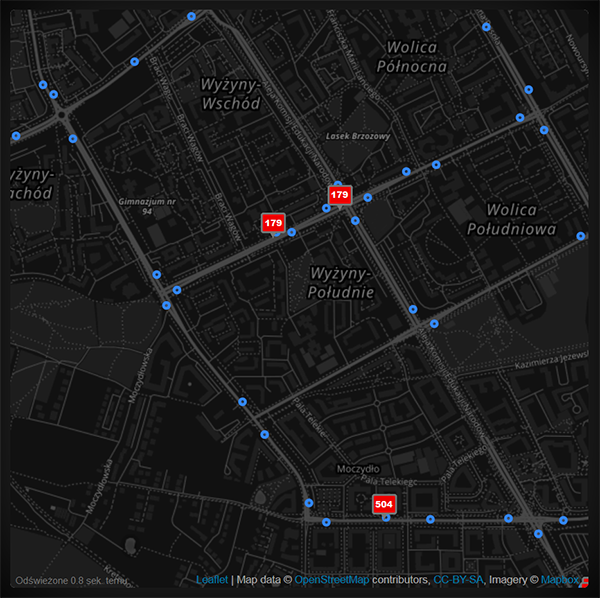

# MMM-Warsaw-Transport

A module of MagicMirror² to show last known geolocation for public transport buses in Warsaw on the map.



## Installation and configuration

- Navigate to the modules directory via the follow command: `cd MagicMirror/modules`
- Clone the module from github: `git clone https://github.com/stelmik/MMM-Warsaw-Transport.git`
- Navigate to the MMM-Warsaw-Transport directory: `cd MMM-Warsaw-Transport`
- Install the dependencies: `npm install`
- Get your public token for Mapbox services (before you have to register on page https://www.mapbox.com/)
- Get API key for public Warsaw data (before you have to register on page https://api.um.warszawa.pl/)
- Add the following configuration to the modules array in the `config/config.js` file (this is example):

```
{
  module: "MMM-Warsaw-Transport",
  position: "bottom_center",
  config: {
    centerLat: 52.2330649,	// latitude of center map
    centerLong: 20.9207682,	// longitude of center map
    mapboxAccessToken: "....YOUR_API_KEY_TO_MAPBOX....",// your public token for mapbox service
    ztmApiKey: "....YOUR_API_KEY_TO_ZTM....",		// your API key for public Warsaw data
    lineNumbers: ['102', '103', 'N44']			// list of bus lines to show on the map
  }
},
```

You may want to set the following options in the config section as well:

| Option | Description | Defaults |
|---|---|---|
| `mapWidth` | Map width (CSS value for `width` attribute) | "600px" |
| `mapHeight` | Map height (CSS value for `height` attribute) | "600px" |
| `centerLat` | latitude of center map | 52.2330649 |
| `centerLong` | longitude of center map | 20.9207682 |
| `zoom` | Zoom level (max value: 18) | 15 |
| `mapboxAccessToken` | Your public token for Mapbox service | |
| `ztmApiKey` | Your API key for public Warsaw data | |
| `lineNumbers` | List of bus lines to show on the map | empty list |

## Tested

- MagicMirror: 2.5.0, 2.5.1, 2.6.0
- nodeJS: 11.6.0
- OS: Raspbian Stretch
- Device: Raspberry Pi 3 B+

## Known Issues
???

## Old Updates

### [1.0.0] - 2019.01.03
- show map
- show bus stops
- show buses
- refreshing current bus positions

## License

MIT License

Copyright (c) 2019 

Permission is hereby granted, free of charge, to any person obtaining a copy
of this software and associated documentation files (the "Software"), to deal
in the Software without restriction, including without limitation the rights
to use, copy, modify, merge, publish, distribute, sublicense, and/or sell
copies of the Software, and to permit persons to whom the Software is
furnished to do so, subject to the following conditions:

The above copyright notice and this permission notice shall be included in all
copies or substantial portions of the Software.

THE SOFTWARE IS PROVIDED "AS IS", WITHOUT WARRANTY OF ANY KIND, EXPRESS OR
IMPLIED, INCLUDING BUT NOT LIMITED TO THE WARRANTIES OF MERCHANTABILITY,
FITNESS FOR A PARTICULAR PURPOSE AND NONINFRINGEMENT. IN NO EVENT SHALL THE
AUTHORS OR COPYRIGHT HOLDERS BE LIABLE FOR ANY CLAIM, DAMAGES OR OTHER
LIABILITY, WHETHER IN AN ACTION OF CONTRACT, TORT OR OTHERWISE, ARISING FROM,
OUT OF OR IN CONNECTION WITH THE SOFTWARE OR THE USE OR OTHER DEALINGS IN THE
SOFTWARE.